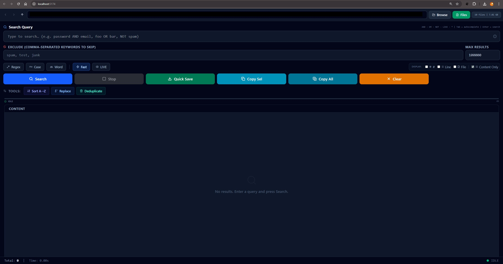
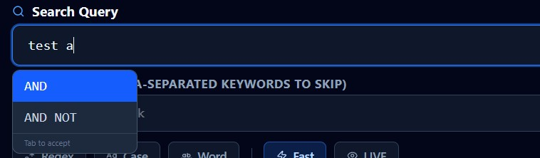
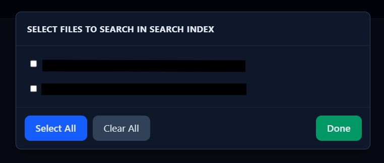
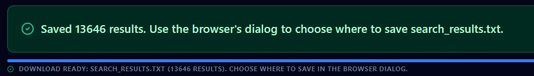

# Advanced Search Tool

A fast, local-only web app for searching across large `.txt` files with advanced query syntax — built for credential/data files but works with any plain-text data.

> **Fully local.** No data leaves your machine. Runs as a Node.js server on `localhost`.

---

## Screenshots

### Main Interface — Search & Results



*Directory bar, query and exclude inputs, display options, action buttons, and paginated results.*

---

### Query autocomplete



*Type `AND`, `OR`, `NOT`, or `LIKE` and press **Tab** to accept a suggestion.*

---

### File Browser



*Click **Files** to select which `.txt` files to search. Shows file sizes and Select All / Clear All.*

---

### Save feedback



*After Quick Save, a green success (or red error) toast appears; it auto-dismisses after 5 seconds.*

---

## Features

### 🔍 Advanced Query Syntax

| Syntax | Meaning | Example |
|---|---|---|
| `keyword` | Lines containing the keyword | `password` |
| `a, b, c` | Lines containing **any** of these (OR) | `gmail, hotmail, yahoo` |
| `a AND b` | Lines containing **both** | `password AND email` |
| `a OR b` | Lines containing **either** | `alice OR bob` |
| `NOT x` | Lines **not** containing x | `NOT test` |
| `a AND NOT b` | Contains a but not b | `password AND NOT test` |
| `a LIKE b` | Lines containing both a and b (proximity style) | `alice LIKE @gmail.com` |
| `key*word` | Wildcard matching | `pass*` |
| Regex | Full regular expression (enable Regex toggle) | `\d{3}-\d{4}` |

**Autocomplete:** type `AND`, `OR`, `NOT`, or `LIKE` and press **Tab** to complete.

---

### 📁 File Browser & Navigation

- Navigate any folder on your PC using the directory bar
- **Back / Forward / Up** buttons for folder history
- **Browse** button opens a Windows native folder picker dialog (stays on top of browser)
- **Files** button opens a panel to select individual `.txt` files for targeted search
- Shows file count and total / selected size in the badge

---

### ⚡ High-Performance Search Engine

Optimised for scanning 20+ large files (multi-GB each):

| Optimization | Detail |
|---|---|
| **Parallel file processing** | 4 files scanned simultaneously (configurable 1–8) |
| **Mandatory-keyword pre-filter** | For `AND` / plain keyword queries, lines are eliminated with a single `indexOf` before any allocation |
| **Exclude pre-filter** | Excluded lines are dropped before the full matcher runs |
| **Streaming reads** | Files are never loaded into memory — read in 8 MB chunks |
| **Single stat pass** | `fs.statSync` called once per file, result cached |
| **No regex per line** | `\r` stripped via char-code check, not `.replace()` |
| **Throttled progress** | Progress reported every 8 MB, not every N lines |

---

### 🎛️ Search Options

| Toggle | Description |
|---|---|
| **Regex** | Treat query as a regular expression |
| **Case** | Case-sensitive matching |
| **Word** | Whole-word boundaries only |
| **Fast** | Enable fast mode (parallel processing active) |
| **LIVE** | Stream results as they arrive |

---

### 📊 Display Options

Toggle any combination of columns:

| Column | Shows |
|---|---|
| **#** | Row number in results list |
| **Line** | Line number within source file |
| **File** | Source filename |
| **Content Only** | Only the matched line text (default) |

The saved file format follows the active display setting — if **Content Only** is on, the saved file contains one line per result with only the content text.

---

### 💾 Results Actions

| Button | Action |
|---|---|
| **Search** | Run the search |
| **Stop** | Cancel a running search |
| **Quick Save** | Browser download as `search_results.txt` (browser asks where to save) |
| **Copy Sel** | Copy selected rows to clipboard |
| **Copy All** | Copy all results to clipboard |
| **Clear** | Clear the results list |

### 🛠️ Tools

| Tool | Action |
|---|---|
| **Sort A→Z / Z→A** | Toggle sort by filename then line number |
| **Replace** | Find-and-replace within result content |
| **Deduplicate** | Remove duplicate lines; shows count removed |

---

### 📦 Data Handling

- Results paginated at **200 per page** — stable even with 500,000+ results
- Deduplication shows `Removed N duplicates (M remaining)`
- Sort toggles between A→Z and Z→A on each click
- Copy / save respects the active display format

---

## Quick Start

### Requirements

- **Windows 10/11** (for native folder picker; search works on any OS)
- **Node.js 18+** — [download](https://nodejs.org)

### Run

Double-click **`start.bat`** — it will:

1. Install npm dependencies (first run only)
2. Start the local API server on port `3000`
3. Start the Vite dev server on port `5174`
4. Open `http://localhost:5174` in your browser

```
web_advanced-search-tool/
├── start.bat          ← double-click to run
```

### Manual start (any OS)

```bash
npm install
npm run dev:all
```

Then open `http://localhost:5174`.

---

## Configuration

| Variable | Default | Description |
|---|---|---|
| `API_PORT` | `3000` | Port for the Express backend |
| `PORT` | `5174` | Port for the Vite frontend |
| `SEARCH_ROOT` | Parent folder of this project | Default directory opened on startup |

Set these in a `.env` file (see `.env.example`) or in `start.bat`.

---

## Project Structure

```
web_advanced-search-tool/
│
├── start.bat                   # One-click launcher (Windows)
├── package.json
├── vite.config.ts
│
├── src/                        # React frontend (TypeScript)
│   ├── App.tsx                 # Main UI component
│   ├── api.ts                  # API client (fetch + SSE)
│   ├── main.tsx
│   └── index.css
│
└── server/                     # Node.js / Express backend
    ├── index.cjs               # HTTP endpoints (listing, search, save, pickers)
    ├── search.cjs              # Parallel search engine (streaming, pre-filter, pool)
    ├── searchParser.cjs        # Query parser (AND/OR/NOT/LIKE, extractMandatoryKeywords)
    └── test-api.cjs            # API smoke tests (node server/test-api.cjs)
```

---

## API Endpoints

| Method | Endpoint | Description |
|---|---|---|
| `GET` | `/api/health` | Health check; returns `{ ok, root }` |
| `GET` | `/api/listing?path=` | List folders + files in a directory |
| `POST` | `/api/search` | SSE stream: `result`, `progress`, `done` events |
| `POST` | `/api/stop` | Abort current search |
| `POST` | `/api/save` | Write results to a file path |
| `POST` | `/api/pick-folder` | Open native Windows folder picker |
| `POST` | `/api/pick-save-path` | Open native Windows Save As dialog |

### Search request body

```json
{
  "query": "alice AND password",
  "exclude": "test, spam",
  "maxResults": 100000,
  "basePath": "C:\\data\\files",
  "filePaths": [],
  "concurrency": 4,
  "options": {
    "caseSensitive": false,
    "wholeWord": false,
    "regex": false
  }
}
```

### SSE events (streamed response)

```
event: result
data: { "line": 1042, "content": "alice:password123", "file": "C:\\data\\file1.txt" }

event: progress
data: { "pct": 34, "processedBytes": 500000, "totalBytes": 1500000, "file": "file1.txt" }

event: done
data: { "total": 128, "timeMs": 3240 }
```

---

## Performance Notes

On 20 × large `.txt` files (multi-GB):

- **Sequential scan (old):** total_time = sum of all file times
- **Parallel scan (current):** total_time ≈ sum_of_file_times / 4
- **With mandatory-keyword pre-filter:** 99%+ of lines skipped before any string allocation for AND / plain-keyword queries

Worst case (OR-only query, no mandatory keyword, regex): full scan of all files — pre-filter cannot help. Use `AND` terms when possible to enable pre-filtering.

---

## Running the API Test

With the server running:

```bash
node server/test-api.cjs
```

Tests: health check, save (creates + verifies + deletes a temp file), empty-results save.

---

## Tech Stack

| Layer | Technology |
|---|---|
| Frontend | React 19, TypeScript, Tailwind CSS v4, Vite 6 |
| Animations | Motion (Framer Motion) |
| Icons | Lucide React |
| Backend | Node.js, Express 4 |
| Search | Custom streaming engine (`readline` + parallel pool) |
| Folder picker | PowerShell `FolderBrowserDialog` / `SaveFileDialog` (Windows) |

---

## License

MIT — use freely for personal or commercial projects.
